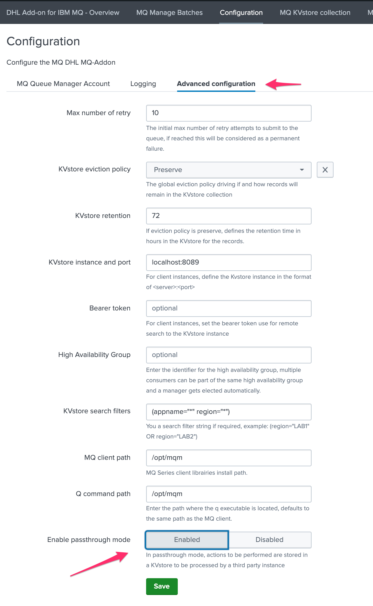
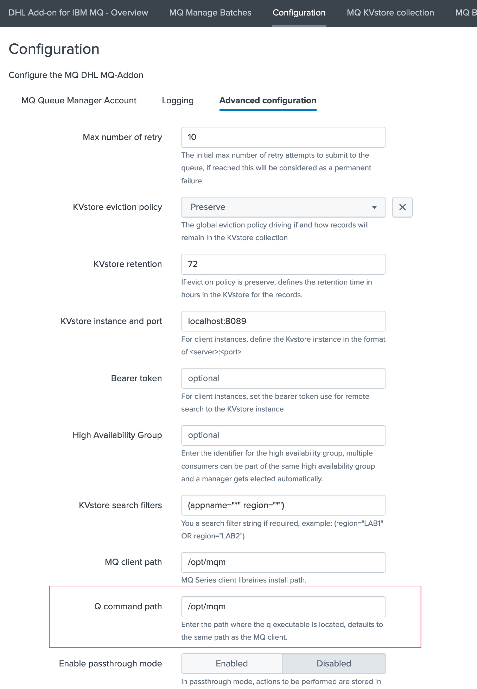
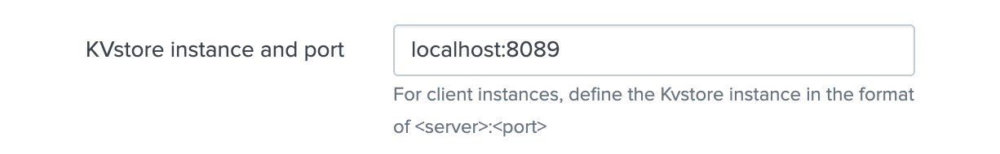

Deployment and base configuration
---------------------------------

Bearer Token requirements
=========================

**A bearer token must be created on the SHC which is going to be used by the Heavy Forwarders to perform their various operations on different KVstore collections part of the TA.**

The bearer token must match a service account user that is a member of the builtin role:

- ``mqsubmission_superadmin``

Deployment of the Add-on on the Search Head layer
=================================================

The Add-on is designed to be running on Splunk Search Heads, either in a standalone more or in a Search Head Cluster context.

The entire configuration can be and should be achieved via the builtin user interface of the Add-on.

Deploy the Add-on to the shcluster deployer and push the SHC bundle
###################################################################

- Respecting Splunk deployment standards, extract the current release in the shcluster deployer
- Push the SHC bundle and monitor for a potential rolling restart of the SHC members

Upgrade the Add-on on on the SHC
################################

- Upgrade is performed in the same way as the initial deployment, extract, and push the bundle
- All configuration items are preserved automatically on the SHC

Configuration on the Search Head layer
######################################

Enabling the passthrough mode
^^^^^^^^^^^^^^^^^^^^^^^^^^^^^

The most important thing to setup on the Search Head layer is to enable the **passthrough mode**, which instructs the application to behave as the front-end rather than the back-end.

**To achieve this, open the configuration UI and click on the enable passthrough mode button then save:**

Configure the max number of retry
^^^^^^^^^^^^^^^^^^^^^^^^^^^^^^^^^

When a message cannot be successfully submitted to IBM MQ, the application can re-attempt automatically to publish the message again until it has reached a certain amount of failures.

The maximal number of failures can defined on the Search Head layer within the UI:

.. image:: img/max_attempts.png
   :alt: max_attempts.png
   :align: center
   :width: 600px

In a nutshell:

- When the message is submitted, its status is pending
- If the message cannot be submitted successfully, its status is set to temporary_failure
- A field called "no_max_retry" contains the maximal amount of attempts configured, and a field called "no_attempts" the number of attempts that was performed until now
- Once no_attempts reaches no_max_retry, the message status is set to permanent_failure
- Finally, when the message reaches its storage retention, it is purged from the KVstore automatically

KVstore eviction policy
^^^^^^^^^^^^^^^^^^^^^^^

.. image:: img/kvstore_eviction_policy.png
   :alt: kvstore_eviction_policy.png
   :align: center
   :width: 600px

The policy defines the Add-on action when the messages reach the following statuses

- success
- permanent_failure
- canceled

If:

- Preserve: the message remains in the KVstore until it reaches its retention
- Delete: the message is immediately deleted from the KVstore

KVstore retention
^^^^^^^^^^^^^^^^^

.. image:: img/kvstore_retention.png
   :alt: kvstore_retention.png
   :align: center
   :width: 600px

This defines the maximal age of a given message stored in the KVstore, in hours.

When the message reaches this value, it becomes a candidate for deletion from the KVstore.

Deployment of the Add-on on Heavy Forwarders
============================================

In the context of the Add-on, Heavy Forwarders are considered as consumers, and will potentially be consuming pending messages stored in the KVstore of the SHC using different concepts of high availability and scope. (applications and regions)

The first step is to deploy the MQClient librairies, then the q command, the Add-on itself and finally its configuration.

MQClient librairies installation
################################

**For each Splunk Heavy Forwarder that will handle the submission of messages to MQ Series, the first requirement is the deployment of the IBM MQClient which can be downloaded here:**

- https://www.ibm.com/support/fixcentral/swg/selectFixes?parent=ibm%2FWebSphere&product=ibm/WebSphere/WebSphere+MQ&release=9.2.1&platform=All&function=fixId&fixids=9.2.2.0-IBM-MQC-LinuxX64&includeSupersedes=0&source=fc

**Once downloaded and uploaded to the server, extract the tarball archive, accept the license and install the packages, example for CentOS / RHEL:**

*Accept the license first:*

::

    /tmp/MQClient/mqlicense.sh

*Then install the RPMs:*

::

    rpm -Uvh /tmp/MQClient/MQ*.rpm

Q command installation
######################

The Q command is a low level MQ utility which is now a paying product. (See: https://www.mqgem.com/q.html) 

However, a free to earlier version is available and already in use at DHL for the manual submission to MQ, this binary utility is the one that is going to be used at DHL for the deployment of the application.

Make sure this command is available on the machine, its path is configurable within the UI of the Add-on, by convention it could be placed in the following directory: (which is the default directory used by the application and the default directory of the MQClient)

::

    /opt/mqm

This path can be customised if needed in the configuration UI of the Add-on:

KVstore instance
################

This setting setting the target of the KVstore instance via the Splunk API (splunkd), in the case of a consumer, this should reflect the SHC target as:

``<address or IP>``:``<port number>``

As soon as this value is not equal to ``localhost``, the consumer acts as client from the SHC. (opposed to a standalone consumer)

**This setting should be modified only for consumers, not for the SHC members.**

Bearer token
############

.. image:: img/bearer_token.png
   :alt: bearer_token.png
   :align: center
   :width: 600px

This settings contains the bearer token used for a remote authentication to the Splunk API, it is stored encrypted in the Splunk crendential store and used as soon as the KVstore instance value differs from ``localhost``

On the SHC side, the bearer token should provide all relevant accesses and permissions to the different KVstore handled by the Add-on.

High availability group
#######################

.. image:: img/ha_group_config.png
   :alt: ha_group_config.png
   :align: center
   :width: 600px

This settings defines the High availability group for the consumer:

- A string idenfitier used for high availability purposes
- The idenfitier can be anything of your choice, however using a meanful naming convention is recommended
- When two or more consumers are members of the same High availability group, the SHC automatically elects a manager for the whole group
- The elected manager is the only consumer that will be allowed to consume messages to be processed, other remain pending as long as they are followers
- If the manager does not sent a keep alive Metadata to the SHC in a short period of time (5 minutes), the SHC re-elects a new member based on the available members
- If there are not any active member left in the HA group, none of the consumers of the group can consume messages any longer

If the setting is not set, the consumer acts as a standalone consumer, and will attempt to consume whatever messages the KVstore search filter allow it to access.

The concept of High Availability is explained in details in the dedicated documentation page.

KVstore search filters
######################

This consumer level setting allows to restrict the scope of a specific Heavy Forwarder. (or multiple Heavy Forwarders configured in the same High Availability group)

Use this setting for scaling purposes, allowing to dedicate the consumers to a specific application and/or regional scope.

The filters are translated to a proper Splunk search when accessing to the KVstore, and can be defined including of the fields available in the KVstore collection.

Only a single active Heavy Forwarder should be consuming the records at the same time, this means the rule filters need to be unique on a per high availability group, using the various Metadata available in the KVstore.

The two main Metadata are the “region” and the “appname”, however it is as well possible to add filters based on the queue managers or the queues by adding the relevant filters.

**Example:**

Let's assume we address 4 MQ managers, deployed amonst 2 regions and serving 2 applications (1 per region), each region has two Splunk Heavy Forwarders for HA purposes, as follows:

- region1: EMEA, MQ managers: MQ1 / MQ2, application: buttercup-emea
- region2: AMER, MQ managers: MQ3 / MQ3, application: buttercup-emea

The configuration of the HA group and the KVstore search filter would be:

*region1: EMEA*

- HA group: ``HA-GRP-EMEA``
- KVstore filter: ``(region="EMEA" appname="buttercup-emea")``

*region2: EMEA*

- HA group: ``HA-GRP-EMEA``
- KVstore filter: ``(region="EMEA" appname="buttercup-emea")``

