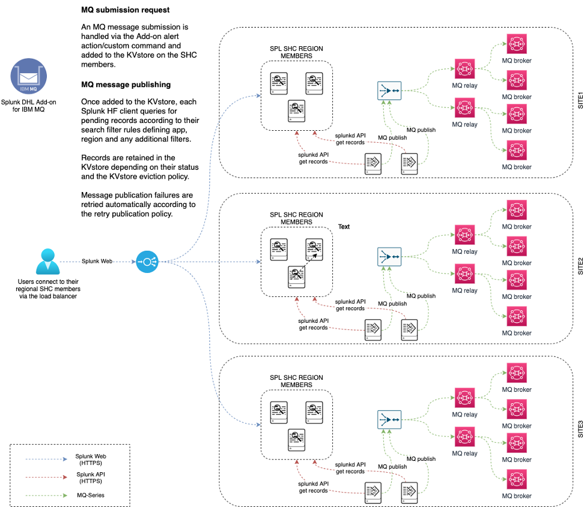
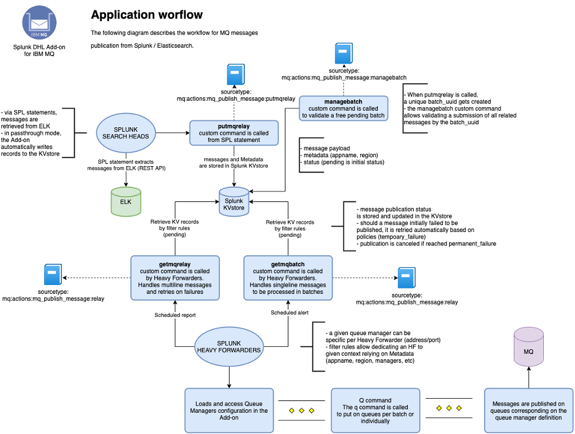

.. TA-dhl-mq documentation master file

Welcome to the DHL Splunk Add-on for MQ submission documentation
================================================================

**The DHL Splunk Add-on for MQ submission provides services for:**

- Publishing on demand messages to various IBM MQ managers in scalable, resilient and distributed manner using various Splunk components
- Handling the message life cycle at any point in time with RBAC capaibilities
- Hanlding temporary and permanent failures with automated retries based on a life cycle concept
- High availability with automated fail-over using multiple Splunk Heavy Fowarders working in a HA group concept

**High level deployment diagram:**

**High level application workflow:**

Overview:
=========

.. toctree::
   :maxdepth: 2

   compatibility
   requirements

Deployment and configuration:
=============================

.. toctree::
   :maxdepth: 2

   deployment
   configuration
   high_availability

User guide:
===========

.. toctree::
   :maxdepth: 2

   userguide

Troubleshoot:
=============

.. toctree::
   :maxdepth: 1

   troubleshoot

Versions and build history:
===========================

.. toctree::
   :maxdepth: 1

   releasenotes
