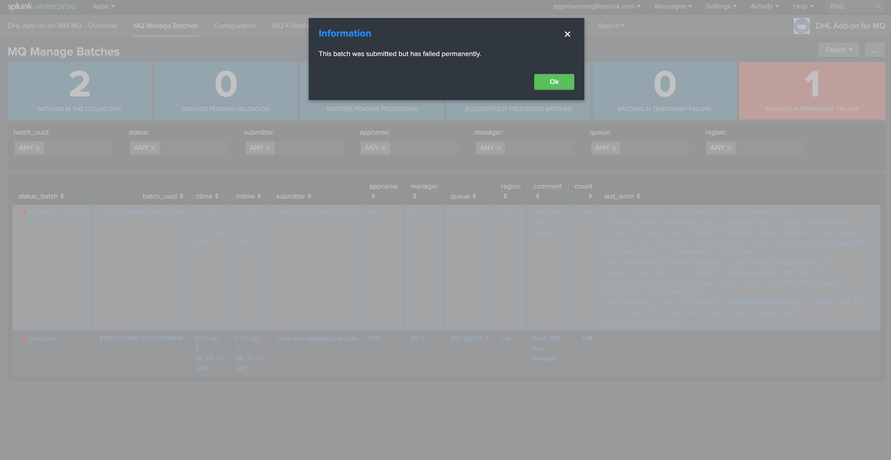
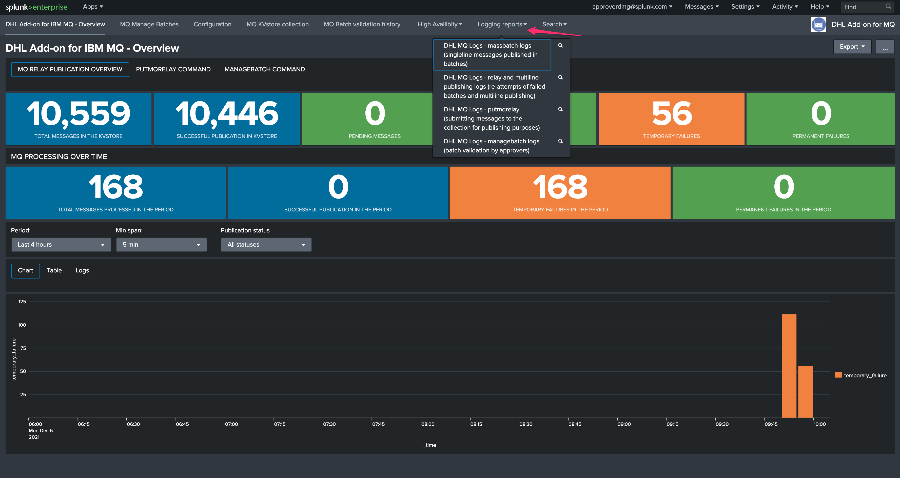

User guide
----------

Submitting messages to IBM MQ Series from Splunk
================================================

**Using the Technical Add-on for IBM MQ-Series developed for DHL allows you submit any message to IBM MQ-Series resulting from a Splunk query, using the following summarised cycle:**

- You run a Splunk search, which generates any number of results containing the message payloads to be sent as well as their identifiers (message ID)

- Additional information are defined at search time, such as the destination Queue manager and the Queue

- A custom command is called to interract and submit these messages to IBM MQ as part of a ``batch``

- The batch is submitted as pending from approval

- An approver receives a notification and approves your demand eventually, the approver can as well decide to refuse the batch and cancel its submission

- After a couple of minutes, the batch is taken into account and messages start to be publishing by the Splunk Heavy Forwarders

- Depending on the message nature (single line versus multiline) and the volume, the batch sent can take a few minutes to be full processed, or more

Sending messages to IBM MQSeries with the putmqrelay command
^^^^^^^^^^^^^^^^^^^^^^^^^^^^^^^^^^^^^^^^^^^^^^^^^^^^^^^^^^^^

**To send messages effectively, you will use a custom command named ``putmqrelay`` which requires the following arguments:**

- ``field_message_id``: the name of the Splunk field containing the message identifiers
- ``field_message``: the name of the Splunk field containing the message payloads
- ``field_appname``: the name of the Splunk field containing the application value, this is a string value which identifies the application
- ``field_region``: the name of the Splunk field containing the region value, this is a string value which idenfities the region for these messages
- ``field_manager``: the name of the Splunk field IBM MQ Queue manager, which needs to be defined on the Splunk Search Heads and the consumers for this application/region 
- ``field_queue``: the name of the Splunk field containing the IBM MQ Queue destination for the messages
- ``dedup``: (true/false) optional dedup at the command level which ensures messages being sent are unique, this can be handled on the upstream search level too
- ``comment``:  optional comment for the submission, this comment will be logged at different levels and made available for the approver to review
- ``max_batchsize``: optional maximal amount of messages per batch, defaults to 10000 messages, when the limit is reached, one or more additional batches are created to accomodate with the query

When the command is called, it will render a summary of the request with the following information:

- ``action``: (success/failure) the result of the operation submit request
- ``result``: a human reable message describing the result of the operation
- ``results_count``: how many messages were requested to be sent by the upstream search
- ``processed_count``: how many messages the command handled
- ``kvstore_count``: how many messages where generated in the Splunk remote KVstore

A simple example of sending a message to MQ:

::

   | makeresults
   | eval message="This is a test demo payload", appname="DMG", region="LAB", manager="QM1", queue="DEV.QUEUE.1", MsgId=md5(message)
   | putmqrelay field_message_id="MsgId" field_message="message" field_appname="appname" field_manager="manager" field_queue="queue" field_region="region" dedup="False" comment="Demo message"

Which results in:

.. image:: img/putmqrelay1.png
   :alt: putmqrelay1.png
   :align: center
   :width: 1200px

Sending a real batch of messages would look like:

At this stage, a batch has been generated and is pending from approval. (see the next section)

Automated quality control performed by the putmqrelay command
^^^^^^^^^^^^^^^^^^^^^^^^^^^^^^^^^^^^^^^^^^^^^^^^^^^^^^^^^^^^^

The ``putmqrelay`` command automatically performs quality control to verify that the operation requested was successful, in some occasions it is possible that the command renders a failure status such as:

.. image:: img/putmqrelay3.png
   :alt: putmqrelay3.png
   :align: center
   :width: 1200px

**A failure status can happen for some technical reasons such as:**

- If dedup is true, and there are duplicated messages submitted to the putmqrelay command (so the count between result_count and processed_count differs)
- If for any reason, the kvstore_count which is the total number of messages returned by the central KVstore did not return in time the expected number of message, this can happen for example if Splunk is heavily loaded and the KVstore insertion took too long
- For any other unexpected technical condition that could happen on the Splunk side

In such as case, you need to verify using the MQ Manage batches user interface that the same number of messages is shown in the count as the one that was submitted during the ``putmqrelay`` command call.

.. hint:: A failure statue returned by the ``putmqrelay`` command is not a hard stop, if the count shows the volume expected in MQ manage batches, you are good to go, this is an additional safety quality control.

Multiline messages versus singleline messages
^^^^^^^^^^^^^^^^^^^^^^^^^^^^^^^^^^^^^^^^^^^^^

**Depending on the type of the messages submitted, the life cycle differs:**

- If all submitted messages are detected as ``singleline-messages``, these messages will very quickly processed by batch via the q command and a report running on the Splunk Heavy Forwarders
- If the submitted messages contain ``multiline-messages``, these cannot be processed by batch and have to be handled via a longer process which handles messages on a per message basis
- If messages that were submitted initially were single line messages, **BUT** the initial submission failed for a technical reason, the re-attempt goes through the same process as the ``multiline-message`` and will take longer than the initial submission

Initial singleline batch submission
;;;;;;;;;;;;;;;;;;;;;;;;;;;;;;;;;;;

**When a batch of single line messages is submitted and validated, the Splunk Heavy Forwarders will load these messages using a scheduled report called:**

- ``DHL MQ messages publishing - batch relay publishing for singleline messages``

This reports loads a custom command called ``getmqbatch`` on the Splunk Heavy Forwarders, and proceed messages by batch of 10000 messages in a single operation.

If the messages failed to be submitted for any technical reasons, the re-attempt will be proceeded by the alert handling multiline messages and re-attempts.

Re-attempt after failures of single-line messages or multi-line messages submission
;;;;;;;;;;;;;;;;;;;;;;;;;;;;;;;;;;;;;;;;;;;;;;;;;;;;;;;;;;;;;;;;;;;;;;;;;;;;;;;;;;;

**When a batch of multiline messages is submitted and validated, the Splunk Heavy Forwarders will load these messages using a modular alert action called:**

- ``DHL MQ messages publishing - relay publishing``

This alert loads a Python based backend which performs the submission operation to IBM MQ, on a per message basis which takes much longer than processing the messages by batch.

Managing MQ submission batches
==============================

**The user interface MQ Manage Batches is designed to allow users to interract with the life cycle of the batches:**

.. image:: img/manage_batches1.png
   :alt: manage_batches1.png
   :align: center
   :width: 1200px

Batches statuses
^^^^^^^^^^^^^^^^

**A single batch can appear in different states:**

- ``pending_validation``: the batch was sumitted and is pending from approval by an approver member of the application role
- ``pending_processing``: the batch was approved already, and is pending from being processed by the application
- ``temporary_failure``: the batch was approved and attempted once or more times, but has currently failed to be processed successfully
- ``permanent_failure``: the batch has reached the maximal amount of attempts, and is now permanently failed, it will not be processed again
- ``succesful``: the batch was processed successfully

Validating a batch pending from approval
^^^^^^^^^^^^^^^^^^^^^^^^^^^^^^^^^^^^^^^^

**A batch that is pending from approval can be approved by relevant users depending on their Splunk role membership:**

.. image:: img/manage_batches2.png
   :alt: manage_batches2.png
   :align: center
   :width: 1200px

.. image:: img/manage_batches3.png
   :alt: manage_batches3.png
   :align: center
   :width: 1200px

**A note can be added by the approver, this information is added to:**

- The different log files technically invovled in the process, and indexed in Splunk automatically
- An history KVstore collection that retains the validation history for easy auditing purposes

*Log files:*

- See the report: "DHL MQ Logs - managebatch logs (batch validation by approvers)"

::

    (`idx_mq`) sourcetype="mq:actions:mq_publish_message:managebatch"

.. image:: img/manage_batches4.png
   :alt: manage_batches4.png
   :align: center
   :width: 1200px

*History approval KVstore collection:*

::

    | inputlookup mq_publish_batch_history | sort - limit=0 ctime | eval ctime=strftime(ctime/1000, "%c")

Shortcut access:

.. image:: img/manage_batches5.png
   :alt: manage_batches5.png
   :align: center
   :width: 1200px

Managing a batch pending from processing
^^^^^^^^^^^^^^^^^^^^^^^^^^^^^^^^^^^^^^^^

**When a batch is pending from processing, this means it is approved but has not been handled by the application, this can happen for various reasons:**

- Right after the initial validation, it can take a few minutes before the messages will start to be processed
- Due to technical issues, if the Heavy Forwarders responsible the consumption of these messages are not currently available, or cannot access the Splunk infrastructure properly

**A user with the relevant permissions can decide to cancel the job via the UI, as it is already approved this function is disabled automatically:**

Managing a batch pending in temporary failure
^^^^^^^^^^^^^^^^^^^^^^^^^^^^^^^^^^^^^^^^^^^^^

**When a batch is in temporary failure, this means that we already attempted at least once to send the messages to MQ, but the operation has failed at least once:**

- A policy defined on the SHC says how many attempts will be processed for the same messages (default to 10 attempts)
- When the maximal number of attempts for a given message has been reached, the status moves automatically to permanent failure
- The manage batch UI show up with the latest error encountered while trying to send to MQ

.. image:: img/manage_batches8.png
   :alt: manage_batches8.png
   :align: center
   :width: 1200px

**The Overview user interface will show as well the activity of the failing messages:**

.. image:: img/manage_batches9.png
   :alt: manage_batches9.png
   :align: center
   :width: 1200px

**When a batch is in temporary failure, the manage batch UI allows the submitter to cancel the batch is necessary: (only users with the application submitter roles, or the super admin, can cancel a running job)**

.. image:: img/manage_batches10.png
   :alt: manage_batches10.png
   :align: center
   :width: 1200px

Managing a batch pending in permanent failure
^^^^^^^^^^^^^^^^^^^^^^^^^^^^^^^^^^^^^^^^^^^^^

**When a batch of messages has reached the maximal number of attempts defined by the application policy, the status moves from temporary_failure to permanent_failure:**

.. image:: img/manage_batches11.png
   :alt: manage_batches11.png
   :align: center
   :width: 1200px

**At this stage, the batch can no longer be canceled as it was already by the system, and the manage batch UI would show the following message if user with approval roles tries to manage it:**

.. hint:: The records will remain in the KVstore for a certain of time which is defined by the retention policy, when this period is over, records are permanently purged

Managing a successful batch
^^^^^^^^^^^^^^^^^^^^^^^^^^^

**When a batch of messages was successfully sent to MQ, the batch appears as successful in the manage batch UI:**

.. image:: img/manage_batches13.png
   :alt: manage_batches13.png
   :align: center
   :width: 1200px

**At this stage, the manage cannot be managed any longer as it has been processed already, the UI would show an informational message when accessing to it:**

.. image:: img/manage_batches14.png
   :alt: manage_batches14.png
   :align: center
   :width: 1200px

Verifying the status of the MQ submission
=========================================

MQ Overview dashboard
^^^^^^^^^^^^^^^^^^^^^

**Splunk administrators, MQ submitters and approvers can rely on the MQ Overview dashboard to verify the activity of the MQ resubmission solution:**

.. image:: img/verify_status1.png
   :alt: verify_status1.png
   :align: center
   :width: 1200px

**Depending on the user status, you will:**

- See all applications and all messages if you are an administrator, or a member of the MQ super admin role
- See all applications and messages for the list of applications you are a member of

**The dashboard show all revelant information, activity and shortcut to all pieces of needed information, such as:**

- The total number of messages stored in the KVstore collection
- The number of successfully submitted messages
- The number of messages in pending status
- The number of batches pending for approval
- The number of messages currently in temporary_failure
- The number of messages currently in permanent_failure
- The overview over time of the same main KPIs

.. hint:: **Active drilldown in the dashboard**

   - You can click on the single forms of the dashboard to automatically access to the proper information
   - For example, if you click on the batch pending single number, this opens for you the MQ manage batch UI filtering on the pending for approval batches

MQ Manage batches
^^^^^^^^^^^^^^^^^

**The MQ manage batch user interface summaries this in a more user friendly way, in the meaning that you get the immediate understanding of the status of the batches, and the errors encounteded, if any:**

.. image:: img/verify_status2.png
   :alt: verify_status2.png
   :align: center
   :width: 1200px

**The user interface will show a given batch as follows:**

- If there are any messages that are pending in the batch, the batch will show the status ``pending_processing``
- If there are any messages that are in temporary_failure, the batch will show the status ``temporary_failure``
- If all messages from the batch have been successfully sent, the batch will show the status ``success``
- If all messages from the batch have reached their final attempt of submission, the batch will show the status ``permanent_failure``
- If the batch was canceled on purpose by an approver, the batch will show the status ``canceled``

Processing logs
^^^^^^^^^^^^^^^

**The application logs every single action that is performed, either when user submit or validate messages, or when the system itself is processing the messages, shortcuts are made available in the application navigation bar:**

**For example, failures would be easily visible in the logs:**

.. image:: img/verify_status4.png
   :alt: verify_status4.png
   :align: center
   :width: 1200px

Automated alerts
^^^^^^^^^^^^^^^^

**An alert is provided out of the box in the application which allows to automatically notifies the approver if something went wrong on the submitted and validated batches:**

.. image:: img/verify_status5.png
   :alt: verify_status5.png
   :align: center
   :width: 1200px

This alert can easily be updated to use any third party integration available to Splunk, and generates alerts or tickets in your corporate systems such as Slack, Teams, Jira, etc.
