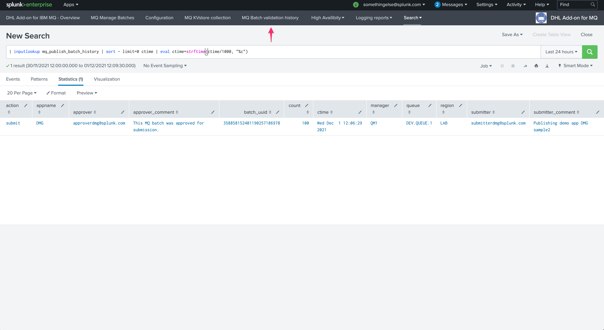

User guide
----------

Managing MQ submission batches
==============================

**The user interface MQ Manage Batches is designed to allow users to interract with the life cycle of the batches:**

.. image:: img/manage_batches1.png
   :alt: manage_batches1.png
   :align: center
   :width: 1200px

Batches statuses
^^^^^^^^^^^^^^^^

**A single batch can appear in different states:**

- ``pending_validation``: the batch was sumitted and is pending from approval by an approver member of the application role
- ``pending_processing``: the batch was approved already, and is pending from being processed by the application
- ``temporary_failure``: the batch was approved and attempted once or more times, but has currently failed to be processed successfully
- ``permanent_failure``: the batch has reached the maximal amount of attempts, and is now permanently failed, it will not be processed again
- ``succesful``: the batch was processed successfully

Validating a batch pending from approval
^^^^^^^^^^^^^^^^^^^^^^^^^^^^^^^^^^^^^^^^

**A batch that is pending from approval can be approved by relevant users depending on their Splunk role membership:**

.. image:: img/manage_batches3.png
   :alt: manage_batches3.png
   :align: center
   :width: 1200px

**A note can be added by the approver, this information is added to:**

- The different log files technically invovled in the process, and indexed in Splunk automatically
- An history KVstore collection that retains the validation history for easy auditing purposes

*Log files:*

- See the report: "DHL MQ Logs - managebatch logs (batch validation by approvers)"

::

    (`idx_mq`) sourcetype="mq:actions:mq_publish_message:managebatch"

*History approval KVstore collection:*

::

    | inputlookup mq_publish_batch_history | sort - limit=0 ctime | eval ctime=strftime(ctime/1000, "%c")

Shortcut access:

Managing a batch pending from processing
^^^^^^^^^^^^^^^^^^^^^^^^^^^^^^^^^^^^^^^^

**When a batch is pending from processing, this means it is approved but has not been handled by the application, this can happen for various reasons:**

- Right after the initial validation, it can take a few minutes before the messages will start to be processed
- Due to technical issues, if the Heavy Forwarders responsible the consumption of these messages are not currently available, or cannot access the Splunk infrastructure properly

**A user with the relevant permissions can decide to cancel the job via the UI, as it is already approved this function is disabled automatically:**

.. image:: img/manage_batches7.png
   :alt: manage_batches7.png
   :align: center
   :width: 1200px

Managing a batch pending in temporary failure
^^^^^^^^^^^^^^^^^^^^^^^^^^^^^^^^^^^^^^^^^^^^^

